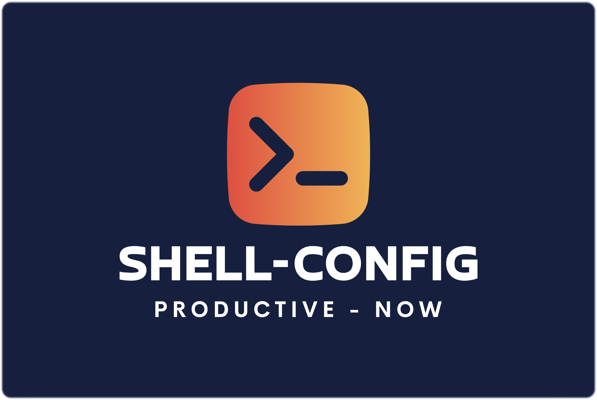

<div align="center">

# Shell-Config CLI - Your MacOS Setup Tool

> **🚀 Simplify your MacOS setup** with `shell-config` - a CLI tool that does it all for you:
> installs apps, configures your dev system, and personalizes your working station.

**Turn your new Mac into a useful working station in minutes**

<br>

[](https://github.com/avivbens/shell-config/releases/latest)
[](https://github.com/avivbens/shell-config/releases/latest)
[](https://github.com/avivbens/shell-config/releases)

[](https://github.com/avivbens/shell-config/stargazers)

[](https://www.buymeacoffee.com/kcao7snkgx)

### <a href="https://avivbens.github.io/shell-config/" target="_blank">Read Our Official Docs 📚</a>

</div>

<div align="left">

## CLI Installation

```bash
sudo -v && /bin/bash -c "$(curl -fsSLk https://raw.githubusercontent.com/avivbens/shell-config/HEAD/src/scripts/init.sh)"
```



## The Reason

`shell-config` is your go-to CLI tool for seamless MacOS configuration, app installation and zsh aliases commands.

Set up the very same environment, with a personalization touch just for your needs, on every MacOS machine within minutes, enjoy a consistent experience across all devices.

</div>

## Contributing

Good to know that you want to contribute to this project! 🎉

See [CONTRIBUTING.md](CONTRIBUTING.md)
