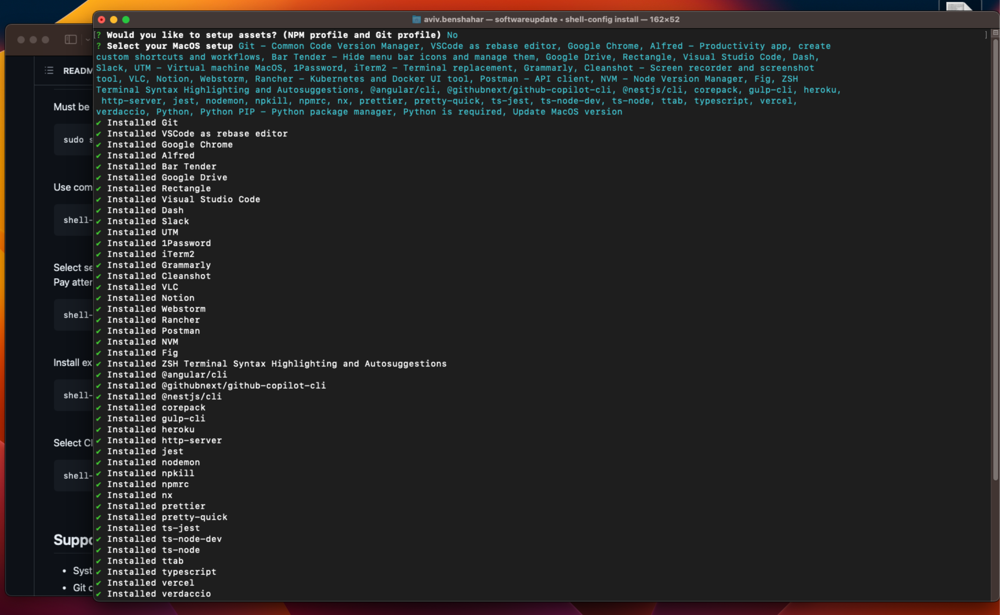

# Shell-Config CLI - Your MacOS Setup Tool

**🚀 Simplify your MacOS setup** with `shell-config` - a CLI tool that tailors configurations, installs apps, and enables seamless team collaboration.

<br>

<div align="center">

[](https://github.com/avivbens/shell-config/releases/latest)
[](https://github.com/avivbens/shell-config/releases/latest)
[](https://github.com/avivbens/shell-config/releases)

</div>

## CLI Installation - No dependencies needed

```bash
sudo cd
function get_remote_execute_file() {
  local file_path="$1"
  local url="https://raw.githubusercontent.com/avivbens/shell-config/master/$file_path"
  local response=$(curl -s "$url")
  echo "$response"
}

get_remote_execute_file "src/scripts/init.sh" | sh
```

**Open a new terminal window after this script!**

## CLI Usage

Must be done BEFORE EACH running the CLI in a new terminal window!

```bash
sudo shell-config --help
```

<br>

Use command in order to opt-in OR opt-out global bash functions.

```bash
shell-config shell
```

<br>

Select secrets to apply, and choose apps to install.
<br>
Pay attention to passwords inputs if needed!

```bash
shell-config install
```

<br>

Install external registries - share your bash functions with others!

```bash
shell-config external --help
```

<br>

Select CLI version / update version, target is optional - default is latest

```bash
shell-config update --target {version}
```

<br>

# Troubleshooting

In case of having permissions issue. try the following:

```bash
sudo chown -R "$USER":admin ~/Desktop
sudo shell-config --help
```

<br>

## Supported Terminal Features

-   System commands
-   Git commands
-   Node & NPM commands
-   Google-Cloud-Sdk
-   Homebrew
-   Fig
-   Autosuggest
-   Autocomplete
-   Colored Correct Code
-   Mongodb
-   Redis
-   Angular
-   Nestjs
-   Typescript

<br>

# Modules federation

### Entry points

-   [.entry-point](zsh/.entry-point.sh) - entry point from `.zshrc`, contains `source` commands for all modules, load the `.zshrc.extends` file
-   [.zshrc.extends](zsh/.zshrc.extends.sh) - entry point for all modules, imports them from `.zshrc.extends.*.sh` files

### Modules

-   [Git](zsh/extends/.zshrc.extends.git.sh)
-   [Npm](zsh/extends/.zshrc.extends.npm.sh)
-   [Angular](zsh/extends/.zshrc.extends.angular.sh)
-   [MongoDB](zsh/extends/.zshrc.extends.mongo.sh)
-   [Python](zsh/extends/.zshrc.extends.python.sh)
-   [Redis](zsh/extends/.zshrc.extends.redis.sh)
-   [Nest](zsh/extends/.zshrc.extends.nest.sh)

<br>

## Screenshots




