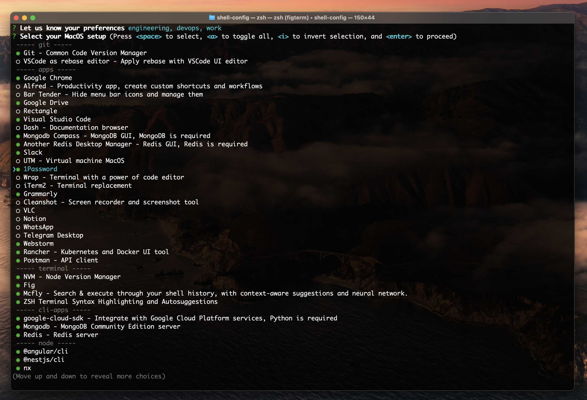
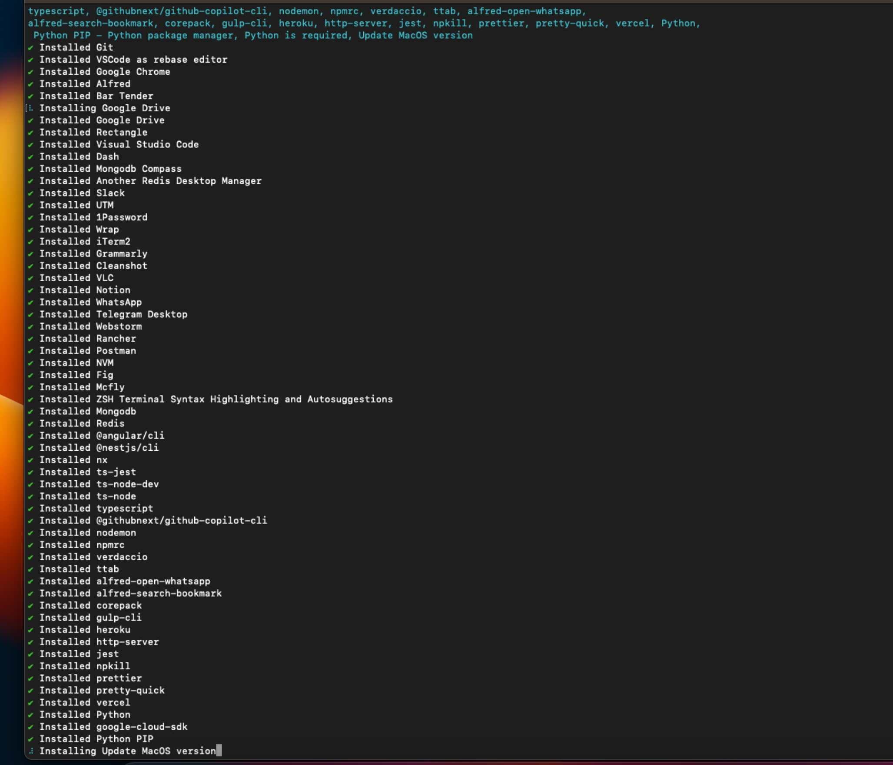

<div align="center">

# Shell-Config CLI - Your MacOS Setup Tool

**🚀 Simplify your MacOS setup** with `shell-config` - a CLI tool that tailors configurations, installs apps, and enables seamless team collaboration.

<br>

[](https://github.com/avivbens/shell-config/releases/latest)
[](https://github.com/avivbens/shell-config/releases/latest)
[](https://github.com/avivbens/shell-config/releases)

[](https://www.buymeacoffee.com/kcao7snkgx)

</div>

<div align="left">

## CLI Installation

```bash
sudo cd
function get_remote_execute_file() {
  local file_path="$1"
  local url="https://raw.githubusercontent.com/avivbens/shell-config/master/$file_path"
  local response=$(curl -s "$url")
  echo "$response"
}

get_remote_execute_file "src/scripts/init.sh" | sh
```

## The Reason

`shell-config` is your go-to CLI tool for seamless MacOS configuration, app installation, and team collaboration.

📦 **Effortless App Installation:**

-   Install apps with default selections or customized user profiles.
-   Choose what suits your needs, whether you're a developer, designer, or data scientist. 💻

🐚 **Plug & Play Shell Settings:**

-   Optimize your command line with bash functions and aliases.
-   Tailor your shell experience by enabling or disabling specific features.

🔄 **Version Control:**

-   Effortlessly switch between CLI versions and receive notifications about new updates.

🖥️ **MacOS Compatibility:**

-   Compatible with MacOS 11 and above, ensuring seamless integration across all MacOS architectures. 🍏💻

🛠️ **Generate & Manage Assets Files:**

-   Easily generate or update asset files like `.npmrc` and `.gitconfig` with the settings you need.
-   `shell-config` supports multiple profiles, allowing you to create and manage various configurations for different projects or team requirements.
-   Seamlessly switch between profiles to adapt your environment to the task at hand.

</div>

## Troubleshooting

In case of having permissions issue, try the following:

```bash
source <(shell-config init-script)
```

## CLI Usage

Opt-in OR opt-out global bash functions and configurations.

```bash
shell-config shell
```

<br>

Select apps to install.
<br>
We're now support [preferences based on your selection!](#Screenshots)
<br>
Pay attention to passwords inputs if needed!

```bash
shell-config install
```

<br>

Apply npmrc and gitconfig files, with secrets.
Support multiple accounts.
<br>
Pay attention to passwords inputs if needed!

```bash
shell-config assets
```

<br>

Install external shell configurations - share your bash functions with others!

```bash
shell-config external --help
```

<br>

Select CLI version / update version, target is optional - default is latest

```bash
shell-config update --target {version}
```

## Supported Terminal Features

-   System commands
-   Git commands
-   Node & NPM commands
-   Google-Cloud-Sdk
-   Homebrew
-   Fig
-   Autosuggest
-   Autocomplete
-   Colored Correct Code
-   Mongodb
-   Redis
-   Angular
-   Nestjs
-   Typescript

<br>

# Modules federation

### Entry points

-   [.entry-point](zsh/.entry-point.sh) - entry point from `.zshrc`, contains `source` commands for all modules, load the `.zshrc.extends` file
-   [.zshrc.extends](zsh/.zshrc.extends.sh) - entry point for all modules, imports them from `.zshrc.extends.*.sh` files

### Modules

-   [Git](zsh/extends/.zshrc.extends.git.sh)
-   [Npm](zsh/extends/.zshrc.extends.npm.sh)
-   [Angular](zsh/extends/.zshrc.extends.angular.sh)
-   [MongoDB](zsh/extends/.zshrc.extends.mongo.sh)
-   [Python](zsh/extends/.zshrc.extends.python.sh)
-   [Redis](zsh/extends/.zshrc.extends.redis.sh)
-   [Nest](zsh/extends/.zshrc.extends.nest.sh)

<br>

## Contributing

Good to know that you want to contribute to this project! 🎉

See [CONTRIBUTING.md](CONTRIBUTING.md)

## Screenshots

<div align="center">






</div>
