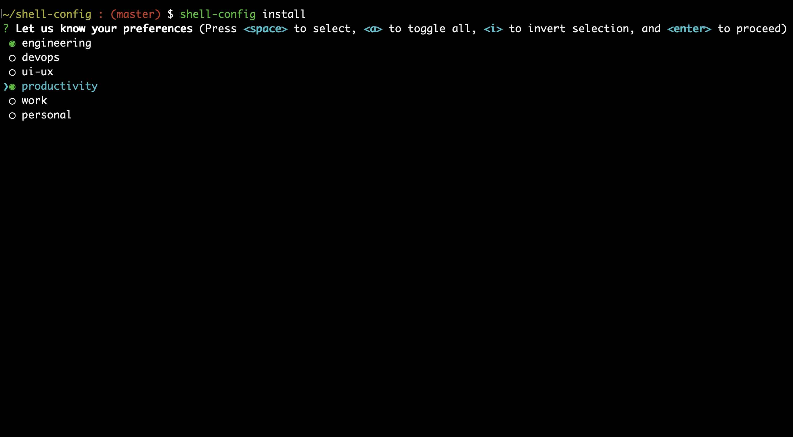
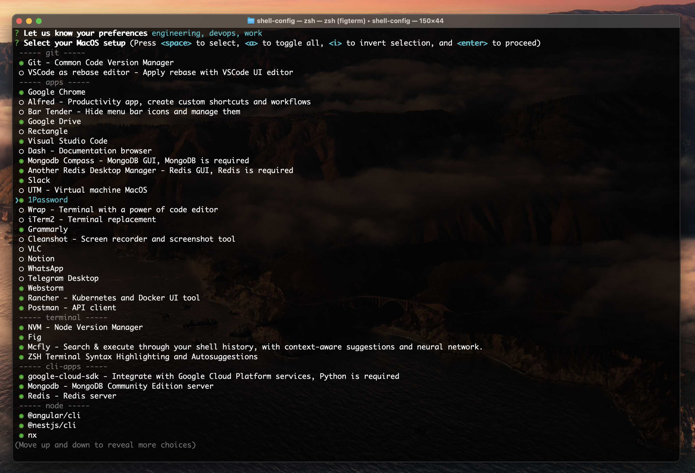
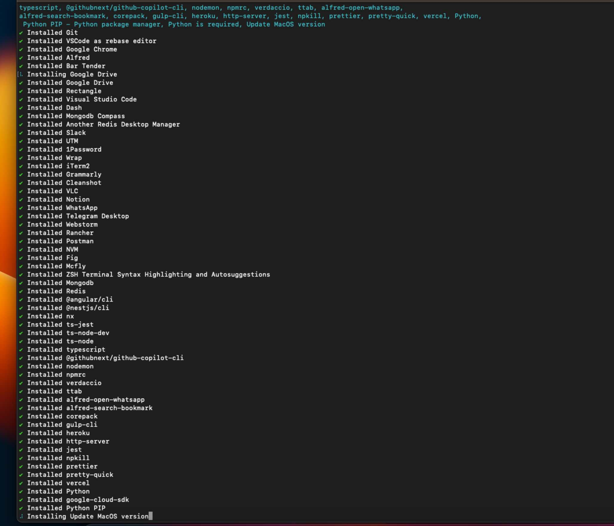

# Install Command

The `install` command is used to install useful MacOS applications.

This command will install the application and all of its dependencies.

## Usage

```bash
shell-config install
```

Select the applications you want to install by using the arrow keys and space bar to select/deselect the applications. Press `Enter` to install the selected applications.

::: warning **Note ❗**
For some applications, you may be asked to provide your password.
Pay attention to the password inputs if needed! *(key icon)*
:::

## Profiles

You can set a predefined selected applications by using the profiles feature. Simply select the relevant profiles you'd like to have, and press `Enter` to preselect relevant applications.

## Examples




